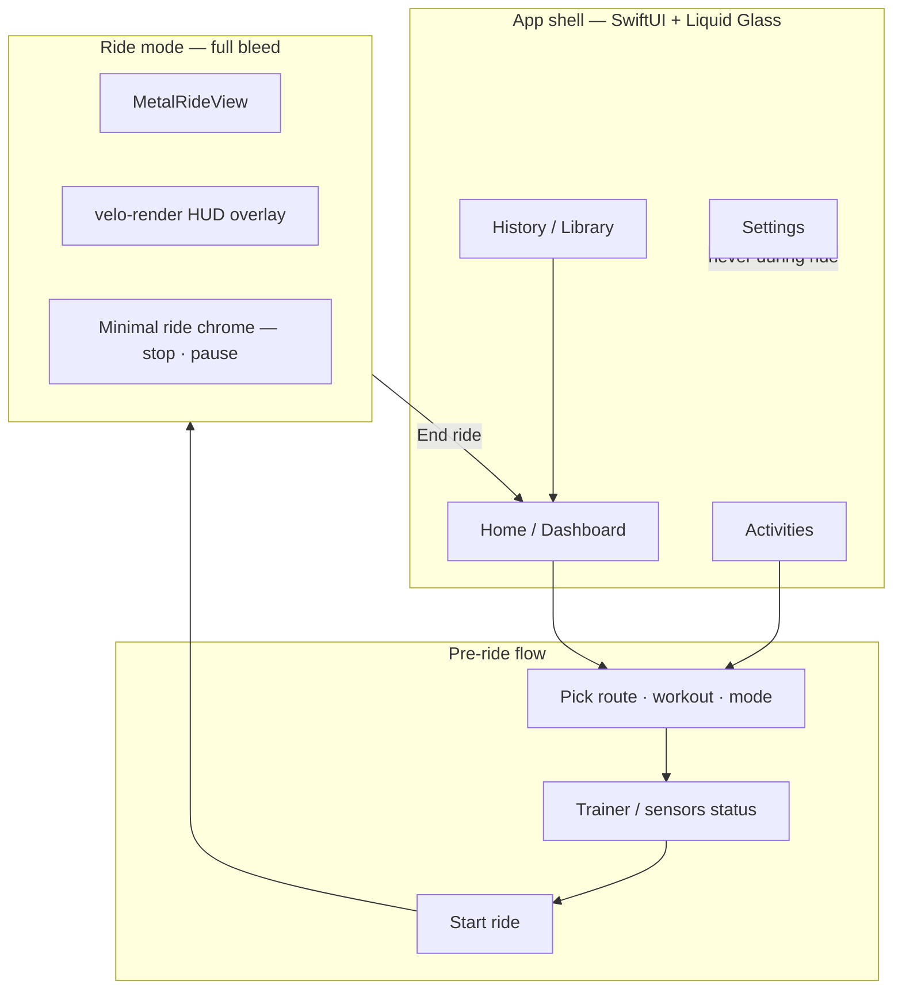

# VeloSim UI Parity

Guides shell work toward **Zwift / MyWhoosh navigation and ride UX**, adapted to VeloSim’s Rust renderer and Liquid Glass chrome rules.

**Companion skills:** [liquid-glass](../liquid-glass/SKILL.md) · [swift-best-practices](../swift-best-practices/SKILL.md) · [quality-pass](../quality-pass/SKILL.md)

**Implementation plan:** [docs/UI_PARITY_PLAN.md](../../../docs/UI_PARITY_PLAN.md)

**Research citations:** [reference.md](reference.md)

---

## Current problem

VeloSim uses a **single persistent sidebar** (`HSplitView` + `SetupChromeView`) beside the Metal viewport. Setup, route import, workouts, ride history, tiles toggle, and start/stop all live in one scroll column. Competitors separate **browse/plan** from **ride** and keep settings out of the in-world view.

**Do not extend the sidebar pattern.** Replace it with a multi-destination shell.

---

## Mandatory patterns (non-negotiable)

These come from Zwift/MyWhoosh research and VeloSim architecture. An implementation that violates any item is **not** UI parity v1.

| # | Pattern | Rule |
|---|---------|------|
| 1 | **Multi-page app shell** | Top-level destinations switch the main content area; no always-visible setup sidebar during browse. |
| 2 | **Dashboard home** | Default landing: recent activity, quick-start cards, status summaries — not raw controls. |
| 3 | **Activity catalog** | Dedicated surface to pick route, workout, or free ride before entering the world. |
| 4 | **Full-screen ride + HUD overlay** | Ride mode: Metal viewport **edge-to-edge**; stats from `velo-render` HUD only. |
| 5 | **No settings in ride view** | API keys, pairing deep config, tiles provider — **never** in ride layout. Minimal ride menu only (pause/stop, optional HUD minimal toggle later). |
| 6 | **Settings as separate destination** | Own page or modal from shell chrome — same IA slot as Zwift profile/settings and MyWhoosh settings. |
| 7 | **Liquid Glass on chrome only** | Navigation bars, cards, sheets — not Metal viewport or HUD. See liquid-glass skill. |
| 8 | **HUD from velo-render** | Power, cadence, HR, speed, workout interval, tiles attribution — Rust `HudSnapshot` / `HudRenderer`, not SwiftUI overlays on the ride view. |

---

## Information architecture (Zwift / MyWhoosh inspired)

VeloSim v1 map — names are VeloSim-specific; structure mirrors competitors.



### Destination table

| Destination | Zwift analogue | MyWhoosh analogue | VeloSim v1 content |
|-------------|----------------|-------------------|-------------------|
| **Home** | Home + For You row | Home / profile summary | Last ride, quick start (continue route, last workout), trainer connected badge |
| **Activities** | Routes · Workouts · Events tabs | Free Ride · Workouts · Events | Route picker, workout picker, ride mode; **3D tiles opt-in per route here** |
| **History** | Activity history (Companion) | Ride stats / library | SQLite ride library (`velo-rides`), Strava publish status |
| **Settings** | Profile menu → settings, pairing | Settings, Link app prefs | `SettingsView` fields: API keys, Strava, defaults — **not** in ride |
| **Ride** | In-world full screen | Full-screen world + HUD | `MetalRideView` only + thin Swift ride bar + Rust HUD |

### Deferred (document, do not build in P0)

See [reference.md](reference.md) — social, garage/avatar, events calendar, companion app, customizable home rows, My List sync.

---

## Layout rules by mode

### Browse mode (Home, Activities, History, Settings)

```
┌─────────────────────────────────────────────────────────────┐
│  [Home] [Activities] [History]          [Settings] [●]    │  ← Liquid Glass nav bar
├─────────────────────────────────────────────────────────────┤
│                                                             │
│   Dashboard cards / catalog / lists (solid backgrounds)   │
│                                                             │
└─────────────────────────────────────────────────────────────┘
```

- Use `NavigationSplitView` or a custom top tab bar — **not** `HSplitView` with Metal visible.
- Metal viewport **hidden or zero-size** until ride starts (or show static route preview thumbnail only).

### Ride mode

```
┌─────────────────────────────────────────────────────────────┐
│ ░░░░░░░░░░░░░░░ MetalRideView (full bleed) ░░░░░░░░░░░░░░░ │
│ ░  velo-render HUD (text/metrics overlay)      ░  [Stop]  ░ │
│ ░░░░░░░░░░░░░░░░░░░░░░░░░░░░░░░░░░░░░░░░░░░░░░░░░░░░░░░░░░░ │
└─────────────────────────────────────────────────────────────┘
```

- **No** `SetupChromeView`, route import, or settings sheet on this screen.
- Swift may add a **single** floating stop/pause control (Liquid Glass capsule) — not a second sidebar.
- Optional P1: HUD minimal toggle (MyWhoosh `U` key pattern) — wire to FFI if needed, default off.

---

## VeloSim-specific boundaries

| Layer | Owns | Must not |
|-------|------|----------|
| `shell-macos` | Navigation, dashboard, catalogs, settings, ride stop bar | Duplicate HUD metrics in SwiftUI over Metal |
| `velo-render` | Scene + `HudRenderer` | Liquid Glass, AppKit |
| `velo-ffi` | `render_frame`, `HudSnapshot`, tiles status callbacks | SwiftUI |
| `velo-cesium` | Tile streaming session | UI chrome |

### Migrate off sidebar

| Today (`SetupChromeView`) | Target destination |
|---------------------------|-------------------|
| Start / Stop ride | Home quick action + Ride mode bar |
| Route import / picker / 3D toggle | **Activities** |
| Workout builder entry | **Activities** |
| Ride history list | **History** |
| Trainer / steering / music | **Activities** pre-ride panel or **Settings** defaults |
| Settings button | **Settings** destination (keep sheet or push) |
| Rust log tail | **Settings** → Developer (P1) or debug menu |

Extract sections into focused views under `shell-macos/Sources/VeloSim/UI/Shell/`.

---

## Suggested Swift structure (implementation agent)

```
shell-macos/Sources/VeloSim/
├── ContentView.swift              # AppShellView + ride/full-screen switch
├── UI/
│   ├── Shell/
│   │   ├── AppShellView.swift     # Nav + destination router
│   │   ├── ShellDestination.swift # enum Home | Activities | History | Settings
│   │   ├── HomeDashboardView.swift
│   │   ├── ActivitiesCatalogView.swift
│   │   ├── RideHistoryView.swift
│   │   └── RideModeView.swift     # MetalRideView + minimal chrome
│   ├── SetupChromeView.swift      # DEPRECATE — split into above
│   ├── SettingsView.swift         # Keep; open from Settings destination
│   └── VeloGlass.swift
└── VeloSimModel.swift             # Add shellPhase: .browse | .riding
```

`VeloSimModel` should expose `@Published var shellPhase: ShellPhase` (or `isRideFullscreen`) so `ContentView` swaps layouts without nesting sidebars.

---

## HUD parity checklist (velo-render)

P0 stays text HUD; layout polish is P1.

- [ ] All ride metrics come from `hud_snapshot()` in `velo-ffi` — no Swift duplicates
- [ ] Workout interval + ERG target lines already in `HudSnapshot` — verify visible in ride
- [ ] Tiles attribution line when Tier B active — already in HUD; remove duplicate from Swift ride UI
- [ ] P1: zone-colored power, elevation mini-map — competitor parity, not P0

---

## Tile loading (P0 checklist)

3D Tiles controls belong in **Activities** (pre-ride) and **Settings** (keys), not ride sidebar.

- [ ] Move `tiles3dEnabled` toggle off in-ride chrome → Activities route detail
- [ ] Surface `tilesProviderStatus` / `tilesLastError` on Activities route card before Start
- [ ] Settings: Google + Cesium keys (`AppSecretsStore`) — already in `SettingsView`
- [ ] Pre-ride: call `setRouteTiles3d` before `startRide`, not mid-sidebar scroll
- [ ] `velo-cesium`: verify corridor fetch errors propagate to `tilesLastError()` (see `session.rs`)
- [ ] `velo-render/tiles.rs`: placeholder texture until decode completes — document gray flash as known issue if unfixed
- [ ] Ride HUD: attribution only — no provider debug strings in Swift overlay

---

## Agent workflow

1. Read this skill + [UI_PARITY_PLAN.md](../../../docs/UI_PARITY_PLAN.md) + liquid-glass.
2. Implement **shell/router first** — empty dashboard beats perfect cards with old sidebar.
3. Move one `SetupChromeView` section per commit (Activities → History → Home).
4. Flip to full-screen ride last; confirm settings unreachable during `.riding`.
5. Run `swift test` / `just test` for shell tests; `cargo test` if FFI phase enum added.

---

## Anti-patterns

- **HSplitView with permanent sidebar** during browse or ride
- **SwiftUI metric overlays** on `MetalRideView` for power/cadence (use velo-render HUD)
- **Glass on HUD or viewport**
- **Settings sheet** callable from ride mode (except post-ride summary)
- **Feature creep**: social feed, avatar garage, events calendar in P0

---

## Quality pass hook

After UI parity lands on `dev`, run [quality-pass](../quality-pass/SKILL.md) and include shell IA in `docs/QUALITY_PASS.md`.
